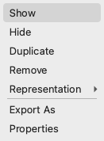

========
Concepts
========

This section introduces the fundamental concepts behind Mosaic and explains the main components of the user interface.

UI Layout
---------

The Mosaic interface consists of several key components:

1. **Menu Bar**: Access to file operations, view settings and help (on macOS its located on the top menu bar)
2. **Tab Bar**: Switches between major functional areas
   - **Segmentation**: Tools for working with point cloud data (clustering, filtering, selection) and analysing object properties
   - **Parametrization**: Tools for fitting and working with models (geometric fitting, mesh operations)
   - **Intelligence**: Advanced features (Dynamically Triangulated Surface simulations, constrained template matching, membrane segmentations)
3. **Ribbon Toolbar**: Context-specific tools for the active tab
4. **Object Browser**: Lists and manages loaded data with:
   - Visibility indicators (colored dots)
   - Editable names
   - Point counts or data types
   - Context menus for operations
5. **3D Viewport**: Main visualization area with:
   - Navigation controls
   - Orientation indicators
   - Optional coordinate axes
6. **Status Bar**: Shows application status and activates optional panels

Additional dock widgets such as the *Volume Viewer* will be displayed at the bottom of the window.

.. figure:: ../../_static/tutorial/mosaic_layout.png
   :width: 100%
   :align: center

   Mosaic interface layout.

Object Browser
--------------

.. figure:: ../../_static/tutorial/mosaic_object_browser.png
   :width: 100%
   :align: right

   Object Browser

The *Object Browser* is your central hub for managing all data in Mosaic. It displays all loaded objects in two main categories:

- **Clusters**: Point cloud objects, e.g. a segmentation, where each point is defined by:

  - Position vector (X, Y, Z coordinates)
  - Normal vector (surface orientation)
  - For oriented data (e.g., protein picks): Full 3D orientation matrix

- **Models**: Geometric shapes and surfaces including:

  - Fitted primitives (spheres, ellipsoids, cylinders)
  - Triangulated meshes
  - DTS simulation trajectories.

The symbol next to each object indicates the data type. The color of the symbol indicates if the object is shown or hidden.

- Single click: Select one object
- Double click: Edit object name
- ``Ctrl+click``: Add to selection
- ``Ctrl+A``: Select all objects
- ``Shift+click``: Select range

Context Menu
------------

   Context menu with object management options

Right-click any object in the *Object Browser* to access:

- **Show/Hide**: Toggle visibility
- **Duplicate/Remove**: Copy or delete objects
- **Change Representation**: Modify how objects appear
- **Export**: Save to various formats
- **Properties**: View detailed information

Interaction Modes
-----------------

Mosaic provides multiple interaction modes for selecting and modifying different types of data. The current mode is always displayed in the status bar at the bottom of the window and indicated by the cursor color.

Point Interaction
^^^^^^^^^^^^^^^^^

**Area Selection (Rubber Band)**

- Press ``R`` to activate rectangular selection mode
- Click and drag in the 3D viewport to select points within a rectangular area
- Press ``E`` to expand selection to entire connected clusters
- Press ``R`` again to exit mode

**Point Drawing**

- Press ``A`` to activate drawing mode
- Click anywhere in the 3D viewport to add new points to the selected cluster
- If no cluster is selected, a new cluster will be created automatically
- Press ``A`` again to exit drawing mode

Object Selection
^^^^^^^^^^^^^^^^

**Object Picking**

- Press ``S`` to activate object picking mode
- Click directly on objects (clusters or models) to select them
- Press ``s`` (lowercase) to switch between cluster and model selection targets
- Selected objects are highlighted and listed in the Object Browser

Advanced Editing
^^^^^^^^^^^^^^^^

**Curve Drawing**

- Press ``Shift+A`` to activate curve drawing mode
- Click to place points along a curve path
- Press ``Enter`` to save the curve as a new cluster of points
- Press ``Esc`` to cancel curve drawing
- Optional: Fit a curve model to the created cluster to parametrize it.

**Mesh Editing**

- Press ``q`` to activate mesh face selection mode
- Click on triangular faces to select them
- Press ``Delete`` to remove selected faces
- Press ``Q`` to activate mesh addition mode
- Click on three vertices to create a new triangular face
- Press ``q`` or ``Q`` again to exit mesh editing modes

.. tip::
   All interaction modes are toggles - press the same key again or a different mode to return to the default viewing mode. Watch the status bar and cursor color to confirm which mode is currently active.

Coordinate System
-----------------

Mosaic does not handle spatial units internally. Instead, imported data is immediately transformed into a consistent reference frame based on the sampling rate (typically Ångstroms for molecular data). This sampling rate is provided by the user or can be extracted from the header of particular file formats, e.g., mrc files.

Assuming a segmentation is loaded from an mrc file with a sampling rate of 6.80 Ångstroms per voxel, Mosaic will multiply the voxel coordinates with the sampling rate. Therefore, the internal scale would be in Ångstroms. The sampling rate also affects:

- Display size
- Filtering operations
- Distance measurements
- Export operations

Mosaic uses a right-handed coordinate system:

- X-axis: Horizontal (left to right)
- Y-axis: Vertical (bottom to top)
- Z-axis: Depth (back to front)

The standard orientation is (0, 0, 1).

Next Steps
----------

Now that you understand the basic concepts and layout of Mosaic, proceed to the :doc:`Working with Data <data/import_export>` section to learn how to handle different data types.
