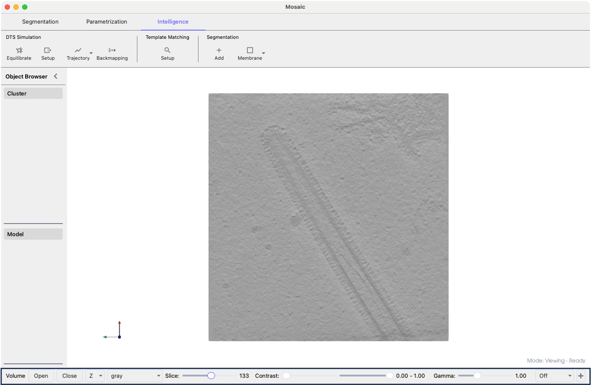

=================
Specialized Views
=================

This section covers specialized visualization tools in Mosaic

Volumes
-------

The Volume Viewer allows you to explore 3D volumetric data in context.

  Mosaic session with Volume Viewer highlighted at the bottom.

To activate the viewer and load a volume:

1. Select **View > Volume Viewer** from the menu
2. The Volume Viewer panel appears at the bottom of the screen
3. In the Volume Viewer panel, click **Open**
4. Navigate to your volume file
5. Select the file and click **Open**

You can modify the visualization using the dedicate display controls:

- **Slice slider**: Browse through volume slices
- **Orientation selector**: Switch between X, Y, Z views
- **Min/Max contrast sliders**: Set display range
- **Gamma slider**: Adjust contrast curve
- **Color palette**: Change visualization (gray, viridis, magma, etc.)
- **Projection modes**:

  - **Off**: Current slice only
  - **Project +/-**: Show structures in slice direction
- **+**: Add another volume viewer

.. tip::
  The **+** button will add a new row with a viewer displaying the same volume. However, you can also render other volumes by using the **Open** button of the newly added viewer and selecting a volume of your choice.

Trajectories
------------

Trajectories in Mosaic represent the same triangular mesh at different points throughout a DTS simulation. To open a trajectory:

1. Go to the **Intelligence** and click the dropdown arrow of the **Trajectory** button
2. Configure scale and offset settings and press *Apply*
3. Select the directory with the FreeDTS trajectory (in .tsi or .vtu format)

.. note::
  Files should follow a numerical sequence (e.g., ``basename_001.tsi``, ``basename_002.tsi``, ...), as produced by FreeDTS.

To select different time points, select **View > Trajectory Player**. Each row corresponds to a distinct trajectory with independent controls.

.. tip::

  Duplicating a trajectory object will not create a new trajectory but rather an object representing the current time point.
