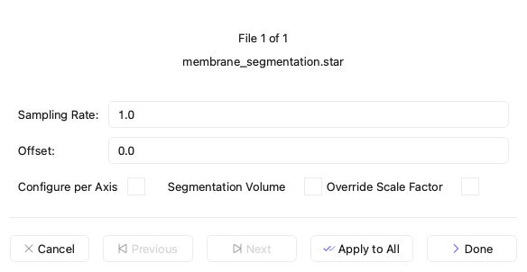
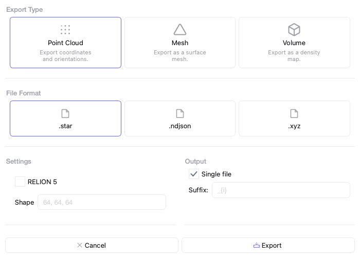

================
File Operations
================

This page documents the menu actions and dialogs for moving data in and out of Mosaic, capturing the viewport, and managing session files.

Import
------

Mosaic uses file extensions to determine the file type. Therefore, you need to make sure the file you are loading has an extension appropriate for its type, such as mrc for CCP4/MRC files.

1. Click **File > Open** (⌘ + O for macOS / Ctrl + O) to open the file selection dialog.

2. Navigate to your data file and select it. Mosaic supports various formats including:

   - MRC, MAP, EM, H5 (volume segmentation data)
   - OBJ, PLY, STL (mesh data)
   - TSV, STAR (point cloud data with angular orientation, e.g. protein picks)
   - XYZ, CSV, TXT, GRO (point cloud data)

   .. note::
      For more information on supported file formats, see the :doc:`File Format Reference <reference/formats>`.

3. Configure import parameters in the dialog that appears:

   - **Scale**: Data coordinates are multiplied by this value (default: 1.0)
   - **Offset**: Shifts data position (default: 0.0)
   - **Sampling Rate**: Defines resolution/spacing (default: 1.0)

   .. note::
      The scale factor and sampling rate is automatically populated using file header information for volume segmentation data.

   Data import dialog showing scale, offset, and sampling rate options.

4. The import settings can be specified per file using the **Previous** and **Next** buttons for navigation. You can use the currently selected settings for all files by using **Apply To All**.

5. Click **Accept** to load the data. A progress bar will open to inform you on the import status.

Your data will appear in the 3D viewport and be listed in the **Object Browser** panel on the right. You can load recent files via **File > Recent Files**.

Export
------

Mosaic distinguishes between three principal export types:

- Point Cloud (point data with orientation)
- Mesh (triangular mesh fit)
- Volume (segmentation volume with integer labels)

1. Right-click on selected object(s) in the *Object Browser* and choose **Export As**

2. Choose the appropriate category

   - Point Cloud (point data with orientation)
   - Mesh (triangular mesh fit)
   - Volume (segmentation volume with integer labels)

3. Choose a specific file format based on your selected category

4. Set parameters specific to the chosen file format

   Data export dialog

The volume category combines objects, others can create separate files. Volume and point cloud categories will scale the objects they operate on based on the associated sampling rate. In case multiple files are selected, they will be named as ``basename_index.extension``.

Sessions
--------

Mosaic allows you to save and restore complete workspaces with all data and settings.

A session includes:

- All data (clusters and models)
- Object visibility status
- Visual properties (colors, sizes, opacity) and attached models
- Object names and metadata

Sessions don't store camera state or external resources like the loaded volume.

Saving Sessions
^^^^^^^^^^^^^^^

1. Select **File > Save Session** (⌘ + S for macOS / Ctrl + S)
2. Choose a location and filename (.pickle extension)
3. Click **Save**

Note the mosaic version used when sharing sessions.

Loading Sessions
^^^^^^^^^^^^^^^^

1. Select **File > Load Session** (⌘ + N for macOS / Ctrl + N)
2. Navigate to your session file
3. Click **Open**

This replaces your current workspace. Unsaved changes will be lost.

Screenshots
-----------

Mosaic provides several options for capturing the current view:

- **Static Image**: Use **File > Save Viewer Screenshot** (``Ctrl+P``) to save the 3D view as a PNG or JPG file. PNG format preserves transparency.
- **Clipboard Copy**:
  - Viewer only (``Ctrl+Shift+C``): Copies just the 3D viewport to clipboard for pasting into other applications
  - Entire window (``Ctrl+Shift+W``): Captures the complete Mosaic interface including all panels and controls

Animations
----------

Mosaic can export animations of your data using **File > Export Animation** (``Ctrl+E``). The Animation Settings dialog offers options for visualizing objects in the context of trajectories and volumes (see :doc:`interface` for more)

- **Animation Types**:

  - **Trajectory**: Animate through DTS trajectory time points
  - **Slices**: Create a fly-through of volume data by progressing through consecutive slices in the Volume Viewer
  - **Reveal Flythrough**: A two-phase animation that first moves through the volume from bottom to top with actors hidden, then reveals all actors while moving back down from top to bottom

- **Export Settings**:

  - **Format**: Choose from MP4, AVI (video formats), or RGBA (frame series as PNG images)
  - **Quality**: Adjust compression quality (higher values mean better quality but larger files)

- **Frame Settings**:

  - **Rate**: Set playback speed in frames per second (FPS)
  - **Stride**: Control frame skipping (stride of 2 means every other frame)
  - **Window**: Specify start and end frames to export only a portion of the animation

Programmatic Access for Developers
----------------------------------

Behind the scenes, Mosaic uses the :py:func:`open_file <mosaic.formats.open_file>` function to import data. This function returns an instance of :py:class:`GeometryDataContainer <mosaic.formats.parser.GeometryDataContainer>`, which represents a collection of objects present in the loaded file. The container can be subset to individual components using standard Python indexing, returning a :py:class:`GeometryData <mosaic.formats.parser.GeometryData>` object. These objects can represent oriented point cloud data as well as triangular meshes.

An example is shown below:

.. code-block:: python

   import numpy as np
   from mosaic.formats import open_file

   # Create example data
   data = np.random.rand(50, 3)
   np.savetxt(
      "example_points.csv", data, delimiter = ",", header="x,y,z", comments=""
   )

   container = open_file("example_points.csv") # GeometryDataContainer
   cluster = container[0]                      # GeometryData
   np.allclose(data, cluster.vertices)         # Returns True

Mosaic uses the :py:func:`open_session <mosaic.formats.open_session>` function to import sessions from pickle files. Generally, session files are not intended to be used directly, but can be be useful for developers building custom workflows.

An example is shown below:

.. code-block:: python

	from mosaic.formats import open_session

	session = open_session("path/to/session.pickle")
	session
	# {
	# 	"shape"   : Shape of the bounding box (optional)
	# 	"_data"   : DataContainer storing cluster data
	# 	"_models" : DataContainer storing model data,
	# }

The session file contains two :py:class:`DataContainer <mosaic.container.DataContainer>` objects that contain cluster and model data respectively. DataContainer instances are a collection of atomic :py:class:`Geometry <mosaic.geometry.Geometry>` objects, each of which corresponds to a distinct object in the *Object Browser*. See :py:func:`MosaicData.load_session <mosaic.data.MosaicData.load_session>` for how they can be used.
