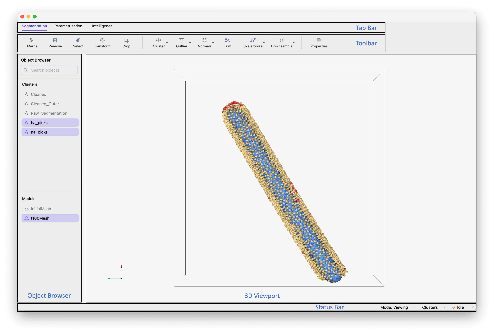
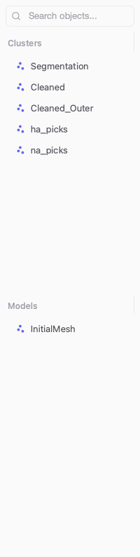
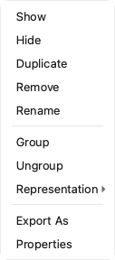
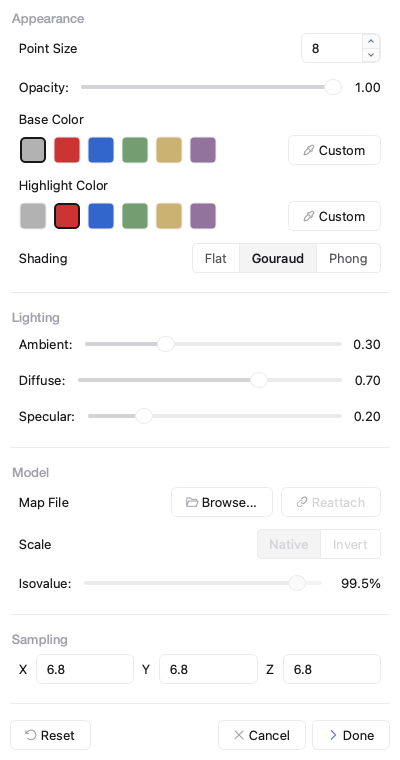
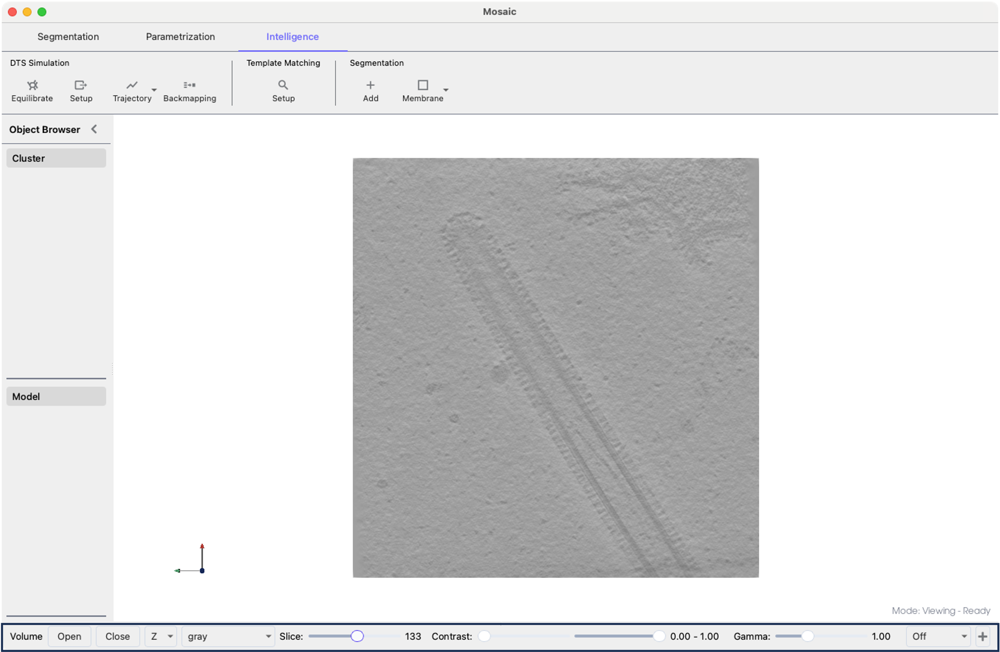

=========
Interface
=========

This page describes the Mosaic UI layout and interaction modes.

UI Layout
---------

The Mosaic interface consists of several key components:

1. **Menu Bar**: Access to file operations, view settings and help (on macOS it's in the top menu)
2. **Tab Bar**: Switches between major functional areas

   - **Segmentation**: Work with point cloud data and analyze object properties
   - **Parametrization**: Create and operate on mathematical models
   - **Intelligence**: Advanced features (Dynamically Triangulated Surface simulations, constrained template matching, membrane segmentations)
3. **Ribbon Toolbar**: Context-specific tools for the active tab
4. **Object Browser**: Lists and manages loaded data with:

   - Visibility indicators with data types
   - Context menus for operations
   - Editable names
5. **3D Viewport**: Main visualization area with:

   - Navigation controls
   - Orientation indicators
   - Optional coordinate axes
6. **Status Bar**: Shows interaction mode, target, and processing status (see below)

Additional dock widgets such as the *Volume Viewer* will be displayed at the bottom of the window.

   Mosaic interface layout.

Object Browser
--------------

   Object Browser

The *Object Browser* lists all loaded objects in two categories:

- **Clusters**: Point cloud objects, e.g. a segmentation, where each point is defined by:

  - Position vector (X, Y, Z coordinates)
  - Unit quaternion to describe orientation (scalar-first w, x, y, z)

- **Models**: Geometric shapes and surfaces including:

  - Fitted primitives (spheres, ellipsoids, cylinders)
  - Triangulated meshes
  - DTS simulation trajectories.

The symbol next to each object indicates the data type. The color of the symbol indicates if the object is shown or hidden.

- Single click: Select one object
- Double click: Edit object name
- ``Ctrl+click``: Add to selection
- ``Ctrl+A``: Select all objects
- ``Shift+click``: Select range

The search field at the top can be used to filter objects in both categories simultaneously.

Context Menu
------------

   Context menu with options

Right-click any object in the *Object Browser* to access:

- **Show/Hide**: Toggle visibility
- **Duplicate/Remove**: Copy or delete objects
- **Group/Ungroup**: Group collections of objects
- **Representation**: Modify how objects appear
- **Export**: Save to various formats
- **Properties**: Set rendering properties (see Properties Dialog below).

Properties Dialog
^^^^^^^^^^^^^^^^^

You can modify the visual properties of items in the **Object Browser**. Right-click on one (or multiple) elements and click the **Properties** entry to bring up the dialog window displayed below.

   Properties dialog.

The properties tab is structured based on:

- **Appearance**: Set color and rendering options of objects.
- **Lighting**: Change the lighting of the scene.
- **Model**: Replace points with volumetric models in corresponding orientation.
- **Sampling**: Modify the sampling rate of the underlying objects.

.. tip::
   When selecting multiple objects the same settings will be applied to all of them.

Status Bar
----------

The status bar at the bottom of the window displays three key pieces of information:

Interaction Mode
^^^^^^^^^^^^^^^^

Shows the current interaction mode (e.g., Viewing, Selection, Drawing). The cursor shape also reflects the active mode.

.. tip::
   Exit any mode by pressing its activation key again or ``Esc``. Modes can also be activated via **Actions** in the menu bar.

**Viewing Mode (Default)**

- Default camera navigation mode
- Use mouse to rotate, pan, and zoom the 3D viewport
- Press ``Esc`` to return to viewing mode from any other mode

**Area Selection** — Press ``r`` to activate rectangular selection mode. Click and drag to select points within a rectangular area. Press ``e`` to expand selection to entire connected clusters.

**Point Drawing** — Press ``a`` to activate drawing mode. Click anywhere in the 3D viewport to add new points. If no cluster is selected, a new one is created automatically.

**Curve Drawing** — Press ``Shift+A`` to activate curve drawing mode. Click to place points along a curve path. Press ``Enter`` to save the curve as a new cluster.

**Object Picking** — Press ``E`` to activate object picking mode. Click directly on objects to select them. Selected objects are highlighted in the Object Browser.

**Mesh Delete** — Press ``q`` to activate mesh face selection mode. Click on triangular faces to select them, then press ``Delete`` to remove.

**Mesh Add** — Press ``Q`` to activate mesh addition mode. Click on three points to create a new triangular face.

Interaction Target
^^^^^^^^^^^^^^^^^^

Indicates whether picking operations apply to **Clusters** or **Models**. Press ``s`` during object picking to switch targets.

Processing Indicator
^^^^^^^^^^^^^^^^^^^^

Shows **Idle** when no tasks are running or **Busy** with an animated spinner during background operations. Click the indicator to open the *Task Monitor*, which displays:

- **Running**: Currently executing tasks
- **Queued**: Tasks waiting to start
- **Completed**: Successfully finished tasks
- **Failed**: Tasks that encountered errors

Expand any task to view its output. Use *Clear Finished* to remove completed and failed tasks from the list.

Coordinate System
-----------------

Mosaic stores coordinates in physical units (typically Ångstroms for molecular data) by multiplying voxel coordinates by the sampling rate on import. The sampling rate is provided by the user or extracted from the file header for formats like mrc.

For example, a segmentation loaded from an mrc file with sampling rate 6.80 Å/voxel ends up scaled to Ångstroms. The sampling rate also affects:

- Display size
- Filtering operations
- Distance measurements
- Export operations

Mosaic uses a right-handed coordinate system:

- X-axis: Horizontal (left to right)
- Y-axis: Vertical (bottom to top)
- Z-axis: Depth (back to front)

The standard orientation is (0, 0, 1).

Auxiliary Panels
----------------

Dock panels complement the main tabs: the Volume Viewer for inspecting volumetric data, and the Trajectory Player for navigating DTS simulation results over time.

Volume Viewer
^^^^^^^^^^^^^

The Volume Viewer displays volume slices alongside the 3D scene.

  Mosaic session with Volume Viewer highlighted at the bottom.

To activate the viewer and load a volume:

1. Select **View > Volume Viewer** from the menu
2. The Volume Viewer panel appears at the bottom of the screen
3. In the Volume Viewer panel, click **Open**
4. Navigate to your volume file
5. Select the file and click **Open**

You can modify the visualization using the dedicated display controls:

- **Slice slider**: Browse through volume slices
- **Orientation selector**: Switch between X, Y, Z views
- **Min/Max contrast sliders**: Set display range
- **Gamma slider**: Adjust contrast curve
- **Color palette**: Change visualization (gray, viridis, magma, etc.)
- **Projection modes**:

  - **Off**: Current slice only
  - **Project +/-**: Show structures in slice direction
- **+**: Add another volume viewer

.. tip::
  The **+** button will add a new row with a viewer displaying the same volume. However, you can also render other volumes by using the **Open** button of the newly added viewer and selecting a volume of your choice.

.. _trajectory-player:

Trajectory Player
^^^^^^^^^^^^^^^^^

The Trajectory Player navigates through DTS trajectory time points. Trajectories are loaded from the :doc:`Intelligence tab <tabs/intelligence>` (see the Trajectory section there for loading instructions and supported formats).

To open the player, select **View > Trajectory Player**. Each row corresponds to a distinct trajectory with independent controls.

.. tip::

  Duplicating a trajectory object will not create a new trajectory but rather an object representing the current time point.

Next Steps
----------

Now that you understand the layout of Mosaic, proceed to :doc:`file_operations` to learn how to load, save, and export data.
