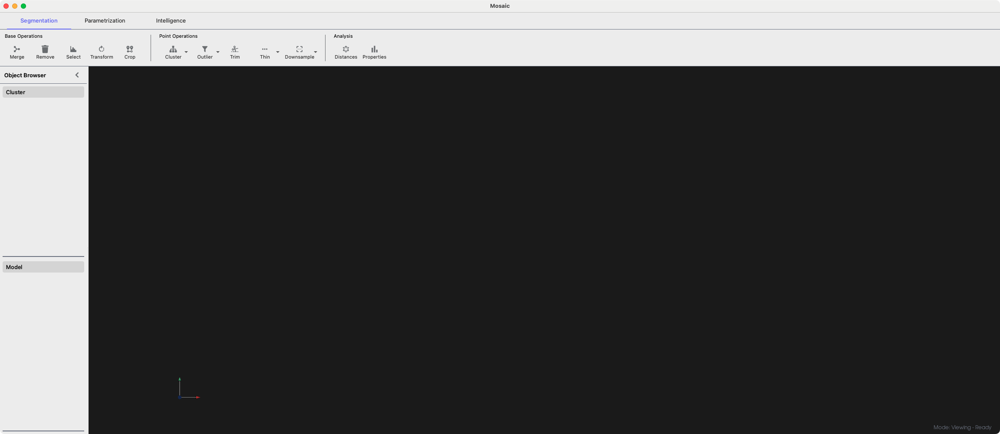
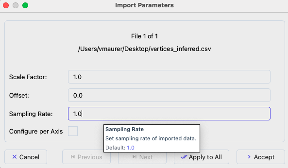

==========
Quickstart
==========

This quickstart guide will help you get up and running with Mosaic quickly, covering the essential steps to load data, visualize it, and save your work.

Launch Mosaic
-------------

Start Mosaic from your command line:

.. code-block:: bash

   mosaic

   Main application interface

.. tip::
   An overview of all available keyboard shortcuts is given in **Help** > **Keybinds**.

Loading Data
------------

1. Click **File > Open** (⌘ + O for macOS / Ctrl + O) to open the file selection dialog.

2. Navigate to your data file and select it. Mosaic supports various formats including:

   - MRC, MAP, EM, H5 (volume segmentation data)
   - OBJ, PLY, STL (mesh data)
   - TSV, STAR (point cloud data with angular orientation, e.g. protein picks)
   - XYZ, CSV, TXT, GRO (point cloud data)

   .. note::
      For detailed information about supported file formats, see the :doc:`File Format Reference <reference/formats>`.

3. Configure import parameters in the dialog that appears:

   - **Scale**: Data coordinates are multiplied by this value (default: 1.0)
   - **Offset**: Shifts data position (default: 0.0)
   - **Sampling Rate**: Defines resolution/spacing (default: 1.0)

   Import Parameters dialog showing scale, offset, and sampling rate options.

4. Click **OK** to load the data.

Your data will appear in the 3D viewport and be listed in the **Object Browser** panel on the right.

.. tip::
   Hover over Mosaic interface elements for tooltips with detailed explanations.

Basic Navigation
----------------

**Mouse Controls:**

- **Rotate**: Left-click and drag
- **Pan**: Shift + left-click and drag
- **Zoom**: Mouse wheel or right-click and drag

**Keyboard Shortcuts:**

- ``X``: View along X-axis
- ``Z``: View along Z-axis
- ``C``: View along Y-axis
- ``V``: Flip camera view direction

Save a Screenshot
-----------------

To save a screenshot of the 3D viewport:

1. Select **File > Save Viewer Screenshot** or press ``Ctrl+P``
2. Choose a location and filename

Save a Session
--------------

To preserve your complete workspace:

1. Select **File > Save Session** or press ``Ctrl+S``
2. Choose a location and filename (automatically adds .pickle extension)
3. This saves:
   - All loaded data (clusters and models)
   - Object visibility settings
   - Visual properties (colors, sizes)
   - Object names and metadata

.. note::
   Sessions do not save camera position or volume viewer state. These are reset when loading a session.

Next Steps
----------

With these basic operations, you can already start exploring your data in Mosaic. For more detailed functionality, continue to the :doc:`Concepts and UI <concepts>` section.
