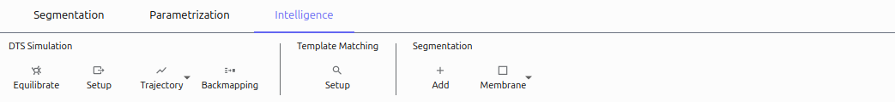

============
Intelligence
============

The Intelligence tab provides advanced features for specialized tasks including membrane modeling, simulation setup, and trajectory analysis.

HMFF Operations
===============

Equilibrate
-----------

Prepares meshes for simulation:

1. Select a mesh model
2. Click **Equilibrate**
3. Configure parameters:
   - Average Edge Length: Target mesh resolution
   - Bounds: Min/max edge length
   - Energy coefficients: Control mesh behavior
4. Select output directory
5. An equilibration process prepares the mesh for simulation

#Screenshot: Equilibrate dialog

Setup
-----

Configures HMFF simulation:

1. Click **Setup**
2. Select equilibrated mesh
3. Configure:
   - Volume data (MRC file)
   - Filtering options
   - Simulation parameters (steps, coefficients)
4. Select output directory
5. Files are prepared for HMFF simulation

#Screenshot: HMFF Setup dialog

Trajectory
----------

Imports simulation results:

1. Click **Trajectory**
2. Select directory with trajectory files
3. Configure scaling and offset
4. Trajectory is loaded into the Trajectory Player

Backmapping
-----------

Maps coarse-grained models to detailed structures:

1. Click **Backmapping**
2. Select surface fit (mesh)
3. Set edge length parameter
4. Add cluster mappings (protein structures)
5. The system is prepared for multi-scale modeling

#Screenshot: Backmapping dialog

Segmentation Operations
=======================

Add
---

Creates a new empty cluster:

1. Click **Add**
2. A new cluster appears in the Object Browser
3. Use drawing mode (``A`` key) to add points

Membrane
--------

Automatically segments membranes in tomograms:

1. Click **Membrane**
2. Select model path (neural network)
3. Configure:
   - Window Size: Processing block size
   - Sampling Rates: Input/output resolution
   - Clustering: Connected components option
4. Select tomogram file
5. Membrane structures are automatically segmented

#Screenshot: Membrane segmentation result

Advanced Workflow Examples
==========================

HMFF Simulation Workflow
------------------------

1. Create or import a mesh model
2. Equilibrate the mesh for simulation
3. Set up HMFF with appropriate parameters
4. Run the external HMFF simulation
5. Import the trajectory results
6. Analyze membrane behavior

Membrane Segmentation Workflow
------------------------------

1. Import a tomogram volume
2. Use the Membrane tool for automatic segmentation
3. Refine results using Segmentation tab tools
4. Fit models to segmented structures
5. Export for further analysis

Multi-Scale Modeling
--------------------

1. Create a coarse-grained membrane model
2. Use Backmapping to place proteins
3. Configure for molecular dynamics simulation
4. Analyze interactions between components

#Screenshot: Multi-scale model example
