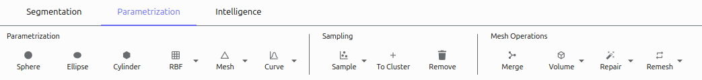

===============
Parametrization
===============

The Parametrization tab provides tools for fitting geometric models to point clouds, analyzing surfaces, and creating meshes.

Fitting Operations
==================

Primitive Fitting
-----------------
Fit basic geometric shapes to point clouds:

Sphere
^^^^^
1. Select a cluster
2. Click **Sphere**
3. A sphere model is fitted to the points

Ellipsoid
^^^^^^^
1. Select a cluster
2. Click **Ellipsoid**
3. An ellipsoid with optimized axes is fitted

Cylinder
^^^^^^^
1. Select a cluster with cylindrical shape
2. Click **Cylinder**
3. A cylinder is fitted along the principal axis

RBF (Radial Basis Function)
^^^
For smooth, non-parametric surfaces:

1. Select a cluster
2. Click **RBF**
3. Choose direction (xy, xz, yz)
4. A smooth surface is interpolated through the points

Mesh
^^^^
Creates triangular mesh surfaces:

1. Select a cluster
2. Click **Mesh**
3. Select method:
   - Alpha Shape: Convex hull with alpha parameter
   - Ball Pivoting: Surface reconstruction
   - Poisson: Watertight surfaces
4. Configure method-specific parameters
5. Click **OK**

#Screenshot: Mesh fitting dialog

Curve
^^^^^
Fits a spline curve to points:

1. Select a cluster with linear structure
2. Click **Curve**
3. Set the order parameter
4. A smooth curve is fitted

Sampling Operations
===================

Sample
------

Creates point clouds from parametric models:

1. Select a model in the Object Browser
2. Click **Sample**
3. Configure:
   - Method: Points or Distance
   - Sampling: Number of points or point spacing
   - Offset: Optional normal-direction offset
4. Click **OK**

To Cluster
----------

Converts a model to a point cloud:

1. Select one or more models
2. Click **To Cluster**
3. The model's vertices are added as a new cluster

Remove
------

Deletes selected models:

1. Select one or more models
2. Click **Remove** or press ``Delete``

Mesh Operations
===============

Volume
------

Creates a mesh from volumetric data:

1. Click **Volume**
2. Select a volume file
3. Configure isovalue and resolution
4. A surface mesh is created at the specified density level

#Screenshot: Volume meshing dialog

Repair
------
Fixes mesh issues:

1. Select a mesh
2. Click **Repair**
3. Set parameters:
   - Hole Size: Maximum hole area to fill
   - Weights: Controls for elasticity, curvature
4. The mesh is repaired with improved topology

Remesh
------

Improves mesh quality:

1. Select a mesh
2. Click **Remesh**
3. Choose method:
   - Edge Length: Uniform edge lengths
   - Vertex Clustering: Simplification
   - Subdivision: Refinement
4. Set method parameters
5. A refined mesh is created

Analyze
-------
Examines mesh properties:

1. Select a mesh
2. Click **Analyze**
3. View statistics:
   - Surface area and volume
   - Edge length distribution
   - Triangle count and quality
4. Generate plots of property distributions

Merge
-----
Combines multiple meshes:

1. Select multiple mesh models
2. Click **Merge**
3. A new combined mesh is created

Next Steps
=========
Continue to the :doc:`intelligence` tab to learn about advanced features like HMFF and membrane segmentation.