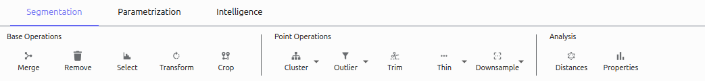

=================
Segmentation Tab
=================

The Segmentation tab provides tools for working with point cloud data, clustering, analysis, and selection operations.

Base Operations
===============

Merge
-----

Combines multiple clusters into a single object:

1. Select multiple clusters in the Object Browser
2. Click **Merge** in the ribbon or press ``M``

Remove
------

Deletes selected clusters:

1. Select one or more clusters
2. Click **Remove** or press ``Delete``

Select by Size
--------------

Filters clusters by point count:

1. Click **Select** in the ribbon
2. Adjust the slider to set a minimum size threshold
3. Clusters below the threshold are automatically selected

Transform
---------

Applies rotation and translation to clusters:

1. Select a cluster
2. Click **Transform**
3. Use the transformation widget to move or rotate the cluster

Point Operations
================

Cluster
-------

Groups points into separate clusters:

1. Select a cluster with multiple distinct structures
2. Click **Cluster**
3. Choose method: Connected Components, DBSCAN, or K-Means
4. Configure method-specific options
5. Click **OK**

Crop
----

Trims points based on distance to other structures:

1. Click **Crop**
2. Select source structures to crop
3. Select target structures to measure distance from
4. Set the distance threshold
5. Choose to keep points within or beyond the threshold

Outlier Removal
---------------

Removes noise points:

1. Select a cluster to clean
2. Click **Outlier**
3. Choose method:
   - Statistical: Removes points based on average distance
   - Eigenvalue: Removes edge points
4. Set threshold and neighbors parameters
5. Click **OK**

Trim
----

Removes points outside specified axis boundaries:

1. Select a cluster
2. Click **Trim**
3. Two cutting planes appear in the viewer
4. Position the planes or use X/Y/Z keys to align them
5. Points between planes are preserved

#Screenshot: Trim planes in action

Thin
----

Reduces point density while preserving structure:

1. Select a cluster
2. Click **Thin**
3. Choose method:
   - Outer: Keep surface points
   - Core: Keep central points
   - Inner: Keep interior points

Analysis
========

Distances
---------

Analyzes distances between clusters:

1. Click **Distances**
2. Select source and target objects
3. View distance distribution and statistics
4. Export data for external analysis

Localization
------------

Colors objects by position or property:

1. Click **Localization**
2. Select objects to colorize
3. Choose coloring method:
   - Identity: Different color per object
   - Camera Distance: Color by distance from viewer
   - Cluster/Fit Distance: Color by distance to reference
4. Select color map and options
5. Click **Apply to Objects**

Statistics
----------

Calculates geometric properties:

1. Click **Statistics**
2. View point counts, bounds, centers, and densities
3. Export statistics as TSV file

Next Steps
=========
Continue to the :doc:`parametrization` tab to learn how to fit parametric models to your point clouds.