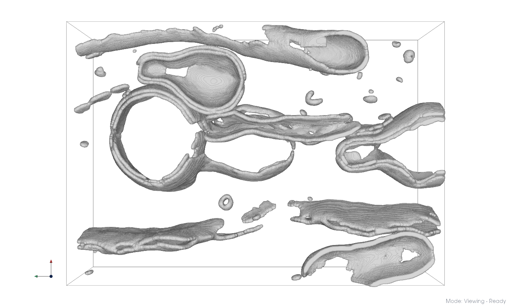
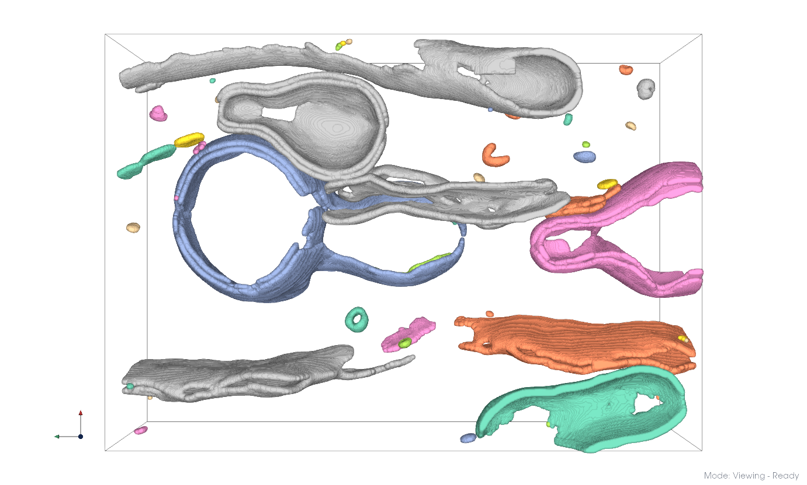
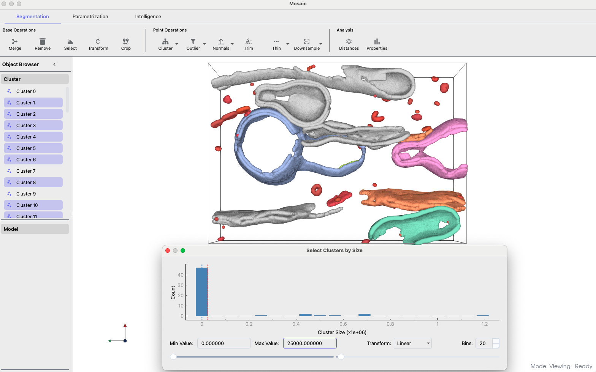
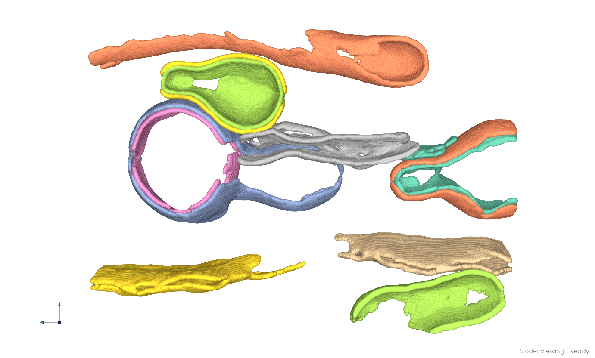
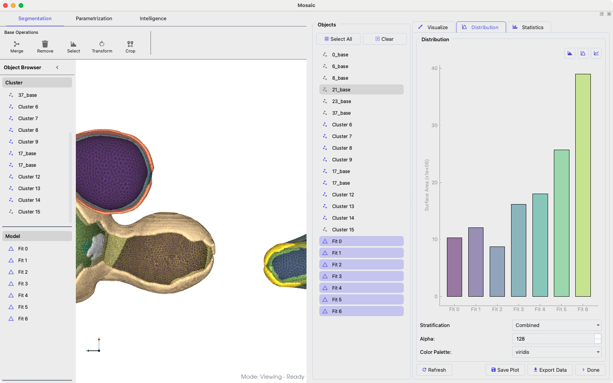

=====================================
Working with :emphasis:`in situ` data
=====================================

This guide outlines general strategies for analyzing *in situ* membrane segmentations using Mosaic. For demonstration purposes, we will use a *Giardia lamblia* dataset, but these approaches extend to other organisms and cellular systems.

Segmentation
------------

If you have a membrane segmentation available, launch Mosaic and load the segmentation using **File > Load Session**. If you do not have a segmentation, create one by following the :ref:`membrane segmentation guide <membrane-segmentation>`.

.. tip::

	Using **Load Session** instead of **Open File** sets default values that optimize downstream processing and data export.

For large datasets with millions of labeled voxels, rendering performance may be limited depending on your hardware. You can modify point rendering settings in **Preferences > Appearance**:

- Linux: Change preset from Ultra to High
- macOS: Use Ultra or Adaptive presets (only supported options)

   Raw membrane segmentation

Connected Components
--------------------

Apply connected component labeling to separate the dataset into disjoint membrane partitions.

1. Select the segmentation in the *Object Browser*
2. Navigate to the **Segmentation** tab and click on the arrow next to the **Cluster** button to set

   - Method: Connected Components
   - Use Points: Check
   - Drop Noise: Check
   - Distance: -1.0

3. Click *Apply*

Connected component labeling identified 55 components. To make them easier to distinguish, you can color them by entity using View > Coloring > By Entity.

   Separated membrane components

.. tip::

	The distance parameter determines connectivity. Setting it to -1 uses the sampling rate (i.e., single voxel separation in the segmentation). Increase this value to merge components separated by multiple voxels in the original segmentation.

Refinement
----------

Remove erroneous segmentations using size-based filtering

1. Click **Select** in the **Segmentation** tab
2. Adjust cutoff values to identify suitable size ranges
3. Remove selected clusters using **Remove**

In this dataset, removing all clusters with less than 25,000 voxels appears reasonable. The selected clusters can be removed by pressing the **Remove** button in the same tab.

   Size-based cluster filtering

.. tip::

	You can pick objects manually by Actions > Pick Objects and points by selection using Actions > Point Selection or their respective keyboard shortcuts. Lamella editing can be done using **Trim**.

Clustering
----------

This dataset contains multiple double membrane systems that are merged in the segmentation. We can separate these using graph-based clustering methods.

Envelope Extraction
^^^^^^^^^^^^^^^^^^^

Taking Cluster 3 as an example, we typically start by thinning the membranes to their envelope (conceptually to their inner and outer leaflets). This reduces the number of computations required for clustering and may lead to better distinction, however, it is not strictly required.

1. Select the target in the *Object Browser*
2. In the **Segmentation** tab, configure **Cluster**

   - Method: Envelope
   - Use Points: Check
   - Distance: -1.0

3. Click *Apply*

.. note::

	If you check Drop Noise the inner part of the membrane will be added as second cluster.

.. list-table::
   :widths: 50 50
   :class: transparent-table

   * - .. figure:: ../../_static/tutorial/giardia/cluster.png
          :width: 100%

          Slice through initial cluster

     - .. figure:: ../../_static/tutorial/giardia/cluster_envelope.png
          :width: 100%

          Identified envelope points

Leiden Clustering
^^^^^^^^^^^^^^^^^

We can use Leiden clustering to separate membrane systems. Conceptually, this approach uses graph representations to cluster regions with high connectivity. The resolution parameter modulates the clustering fineness. It is typically sufficient to explore the resolution starting with the default value of -7.3 and moving up to -2.3 in increments of 1.0.

Here, we use a resolution of -7.3, which resulted in two distinct clusters. We repeat clustering with a resolution of -6.3 for both clusters, which yields the results shown below. The individual clusters can be merged into distinct membrane systems by simple selection.

.. list-table::
   :widths: 50 50
   :class: transparent-table

   * - .. figure:: ../../_static/tutorial/giardia/leiden.png
          :width: 100%

          Leiden clustering result

     - .. figure:: ../../_static/tutorial/giardia/leiden_merged.png
          :width: 100%

          Merged membrane segmentation

This procedure can be repeated analogously for the remainder of the dataset.

   Clustering applied to the entire dataset.

.. tip::

	Connectivity differences might not always be sufficient to yield meaningful clusters. In such cases, purely distance-based methods such as K-Means clustering should be preferred. DBSCAN or Birch clustering can also yield good results, but their parameters can be more difficult to tune.

Meshing
-------

We fit triangular meshes to the individual clusters to analyze their geometric properties.

1. Select membrane clusters in the **Object Browser**
2. Navigate to the **Parametrization** tab
3. Click on the arrow next to the **Mesh** button and configure

   - Method: Alpha Shape
   - Elastic Weight: 1.0
   - Curvature Weight: 10.0
   - Volume Weight: 0.0
   - Boundary Ring: 1
   - Neighbors: 15
   - Alpha: 1.0
   - Scaling Factor: 6.0
   - Distance: 2.0

4. Click *Apply*

.. list-table::
   :widths: 50 50
   :class: transparent-table

   * - .. figure:: ../../_static/tutorial/giardia/systems.png
          :width: 100%

          Membrane segmentations

     - .. figure:: ../../_static/tutorial/giardia/systems_meshed.png
          :width: 100%

          Membrane meshes

Alpha shapes are generalizations of convex hulls and well-suited for convex membrane morphologies, potentially with disconnected components. Reducing alpha allows the mesh to deviate from the convexity constraint, but typically at a cost of mesh quality and completeness.

Therefore, other methods such as Ball Pivoting should be preferred in such cases. For the example shown in the Clustering section, we applied core-thinning using **Segmentation > Thin** with a radius of 40 and meshed the generated cluster using Ball Pivoting with a radius of 50. Poisson reconstruction also generates complete meshes, but with a different algorithm for mesh completion compared to alpha shapes and Ball Pivoting.

Once meshes are generated, we can analyze their geometric properties using **Segmentation > Properties**

   Analyzing mesh properties.

The analysis provides quantitative measurements for comparative studies

.. list-table::
   :widths: 33 33 33
   :class: transparent-table

   * - .. figure:: ../../_static/tutorial/giardia/systems_area.png
          :width: 100%

          Mesh area

     - .. figure:: ../../_static/tutorial/giardia/systems_volume.png
          :width: 100%

          Mesh volume

     - .. figure:: ../../_static/tutorial/giardia/systems_curvature.png
          :width: 100%

          Mesh mean curvature (radius 10)
