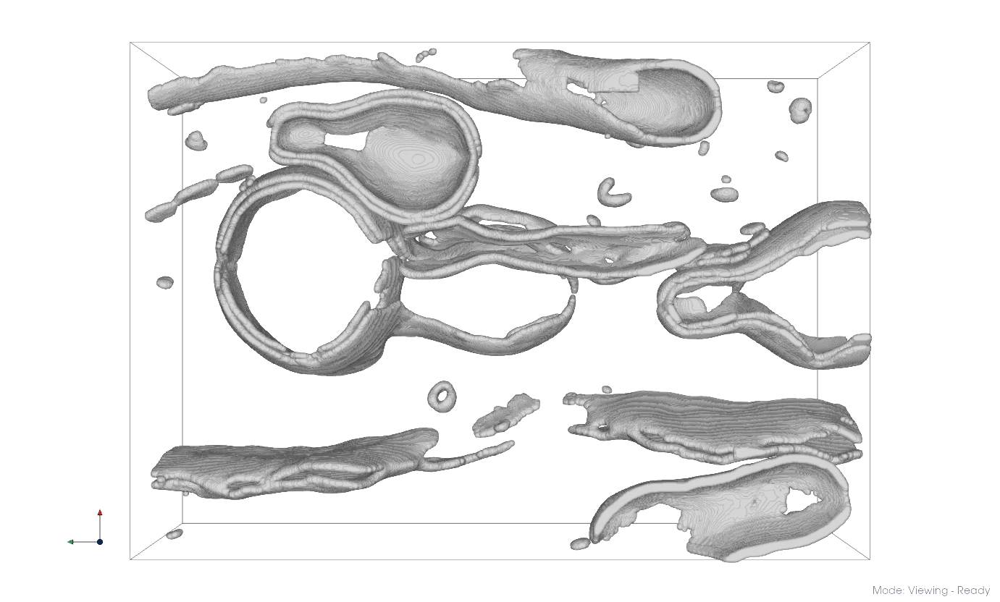
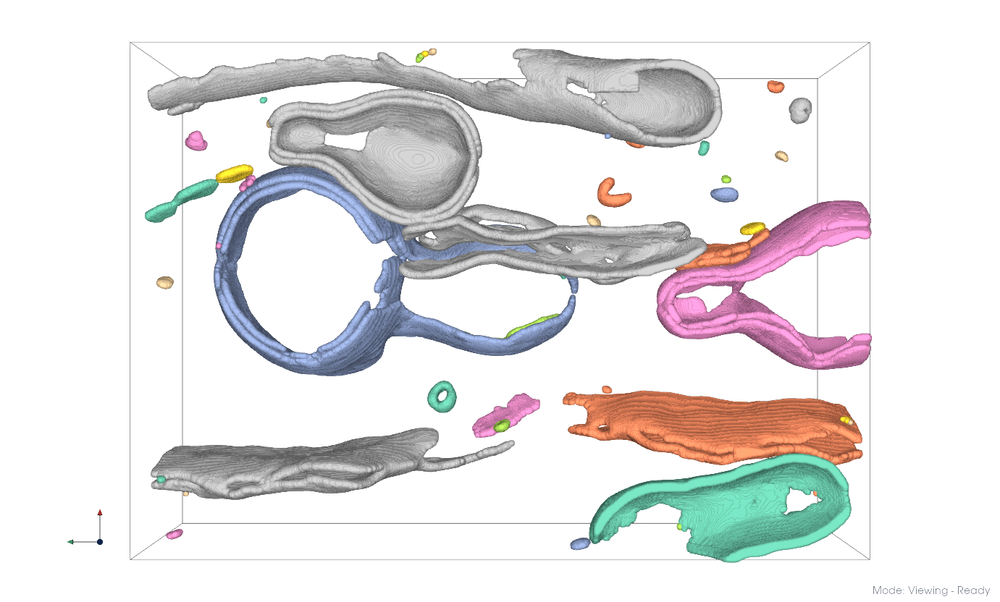
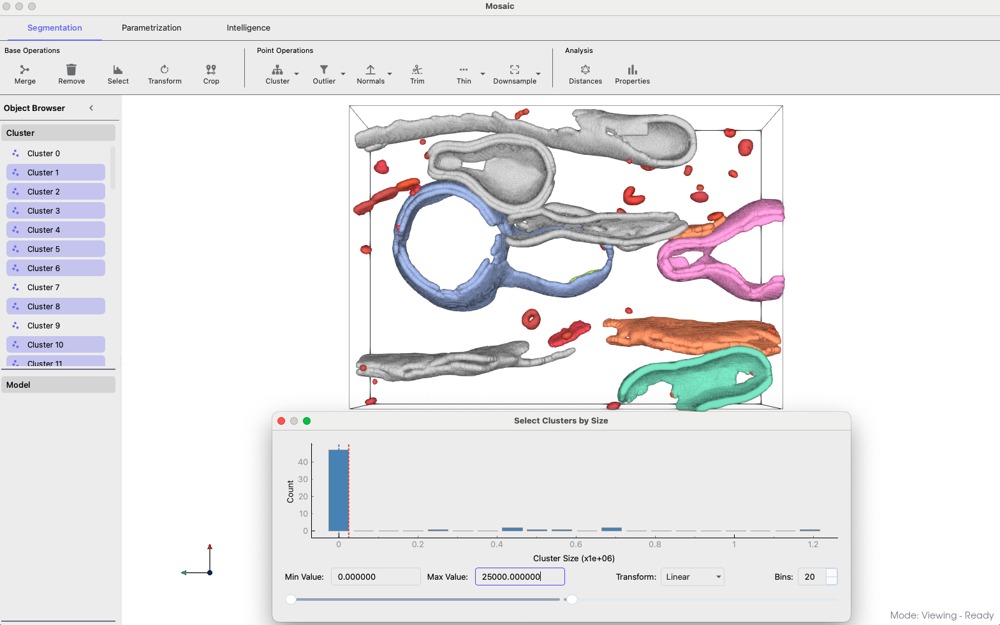
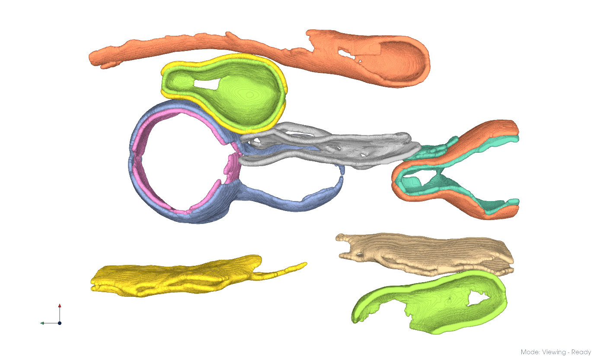
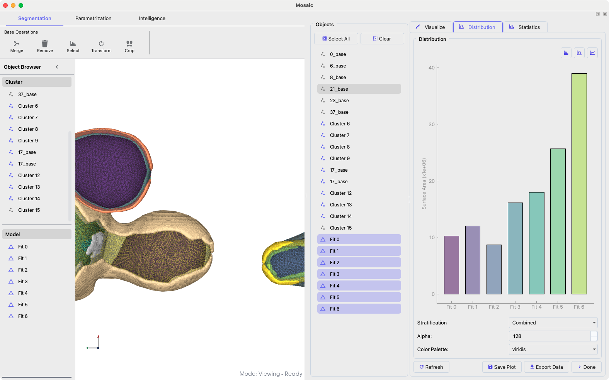

=====================================
Working with :emphasis:`in situ` data
=====================================

This guide outlines strategies for analyzing *in situ* membrane segmentations using Mosaic, demonstrated on a *Giardia lamblia* dataset.

Segmentation
------------

Load your segmentation via **File > Open** or drag and drop it into the viewport. If you don't have one, follow the :ref:`membrane segmentation guide <membrane-segmentation>`.

For large datasets, adjust the interaction point budget via the **Settings** button (top-right gear icon). *Ultra* disables interaction decimation entirely; *Balanced* lets you set a point budget with a slider.

.. versionchanged:: v1.3.0
   Rendering presets were simplified to *Ultra* (no LOD) and *Balanced* (configurable point budget). The settings moved from **Preferences > Appearance** to the **Settings** button in the toolbar.

   Raw membrane segmentation

Connected Components
--------------------

Separate the dataset into disjoint membrane partitions:

1. Select the segmentation in the *Object Browser*
2. In the **Segmentation** tab, click **Cluster** and configure:

   - Method: *Connected Components*
   - Use Points: Check, Drop Noise: Check, Distance: Auto (-1.0)

You can color objects by entity using View > Coloring > By Entity.

   Separated membrane components

.. tip::

	Distance defaults to single-voxel connectivity derived from the object's sampling rate. Increase it to bridge gaps of multiple voxels.

Refinement
----------

Remove small erroneous clusters using size-based filtering:

1. Click **Select** in the **Segmentation** tab
2. Adjust cutoffs to identify suitable size ranges (here, <25,000 voxels)
3. Click **Remove**

   Size-based cluster filtering

You can also interact with data directly through the viewport. Press **r** to activate crosshair selection for picking points or regions, and **e** to pick individual geometries. For lamella-style editing, use the **Trim** tool.

Clustering
----------

Some membrane systems (e.g. double membranes) remain merged after connected components. Graph-based clustering can separate them.

Envelope Extraction
^^^^^^^^^^^^^^^^^^^

Optionally thin membranes to their envelope first, reducing computation and improving separation:

1. Select the target cluster
2. Click **Cluster** and configure:

   - Method: *Envelope*
   - Use Points: Check, Distance: Auto (-1.0)

.. note::

	Check Drop Noise to add the inner membrane part as a second cluster.

.. list-table::
   :widths: 50 50
   :class: transparent-table

   * - .. figure:: ../../_static/tutorial/giardia/cluster.png
          :width: 100%

          Slice through initial cluster

     - .. figure:: ../../_static/tutorial/giardia/cluster_envelope.png
          :width: 100%

          Identified envelope points

Leiden Clustering
^^^^^^^^^^^^^^^^^

Leiden clustering uses graph connectivity to separate membrane systems. Whenever you have an object whose parts should be separable based on shape imposed by local connectivity, Leiden is a good choice. The resolution parameter controls fineness, start at -7.3 and increase in steps of 1.0.

Here, resolution -7.3 yielded two clusters. Repeating at -6.3 for each produces the results below. Merge the resulting clusters into distinct membrane systems by selection.

.. list-table::
   :widths: 50 50
   :class: transparent-table

   * - .. figure:: ../../_static/tutorial/giardia/leiden.png
          :width: 100%

          Leiden clustering result

     - .. figure:: ../../_static/tutorial/giardia/leiden_merged.png
          :width: 100%

          Merged membrane segmentation

Repeat for the remainder of the dataset.

   Clustering applied to the entire dataset.

.. tip::

	When connectivity alone is insufficient, use distance-based methods like K-Means. DBSCAN and Birch can also work but are harder to tune.

Meshing
-------

Meshing algorithms reconstruct a surface from a set of input points. Dense segmentations (hundreds of thousands of voxels) should almost never be meshed directly (unless you are using the Flying Edges method, which operates on voxel grids natively). The high point density doesn't improve the mesh and makes computation unnecessarily slow. Instead, reduce the input first using for instance:

- **Skeletonize** (Segmentation tab) to extract the structural center or boundary of the membrane, typically reducing point count by an order of magnitude while preserving shape.
- **Downsample > Center of Mass** (Segmentation tab) to merge nearby points into centroids at a controllable radius, producing uniform spacing without changing the geometry's extent.

Either produces a lightweight point cloud that meshes quickly and cleanly.

Fit triangular meshes to the reduced point clouds:

1. Select membrane clusters in the **Object Browser**
2. In the **Parametrization** tab, click **Mesh** and configure:

   - Method: *Alpha Shape*
   - Smoothness: 1.0, Curvature Weight: 1.0, Pressure: 0.0
   - Boundary Ring: 1, Alpha: 1.0

   .. versionchanged:: v1.2.1
      Elastic Weight renamed to Smoothness (rescaled). Volume Weight renamed to Pressure. Neighbors, Scaling Factor, and Distance were removed. Curvature Weight: 10.0 is sensible pre 1.2.1.

.. list-table::
   :widths: 50 50
   :class: transparent-table

   * - .. figure:: ../../_static/tutorial/giardia/systems.png
          :width: 100%

          Membrane segmentations

     - .. figure:: ../../_static/tutorial/giardia/systems_meshed.png
          :width: 100%

          Membrane meshes

Alpha shapes work well for convex membrane morphologies. For non-convex membranes, use Ball Pivoting (e.g. with core-thinning via **Skeletonize** at radius 40, then Ball Pivoting at radius 50). Poisson reconstruction also produces complete meshes using a different completion strategy.

.. versionchanged:: v1.1.0
   **Thin** was renamed to **Skeletonize**.

Analyze geometric properties via **Segmentation > Properties**:

   Analyzing mesh properties.

.. list-table::
   :widths: 33 33 33
   :class: transparent-table

   * - .. figure:: ../../_static/tutorial/giardia/systems_area.png
          :width: 100%

          Mesh area

     - .. figure:: ../../_static/tutorial/giardia/systems_volume.png
          :width: 100%

          Mesh volume

     - .. figure:: ../../_static/tutorial/giardia/systems_curvature.png
          :width: 100%

          Mesh mean curvature (radius 10)
