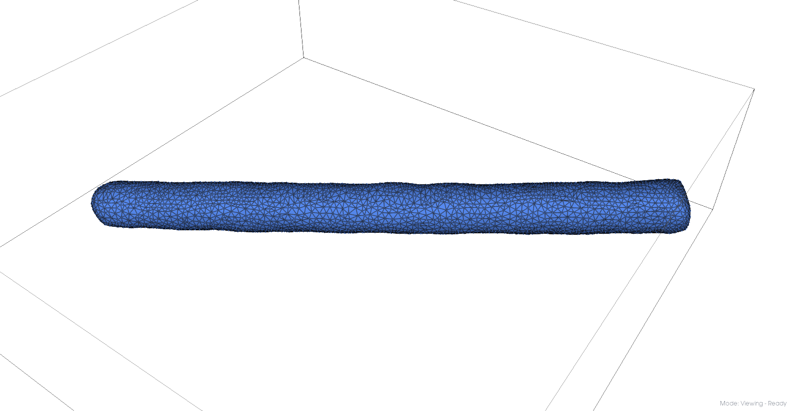
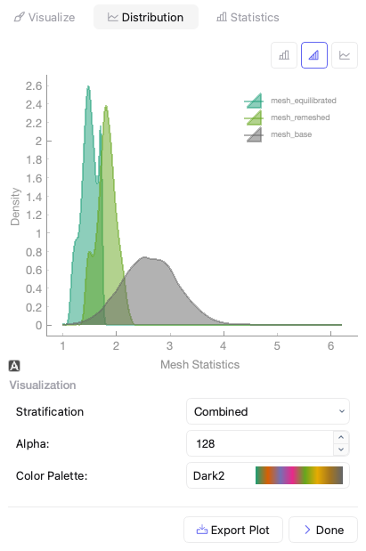
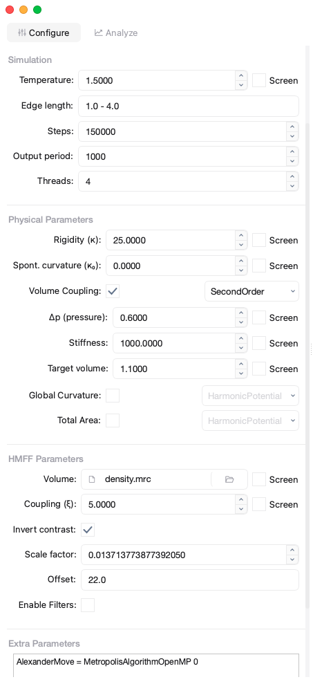

=================
Influenza A Virus
=================

This tutorial guides you through analyzing Influenza A Virus (IAV) virus-like particles (VLPs) using Mosaic, from initial segmentation to creating coarse-grained molecular models.

Data Acquisition
----------------

In this tutorial we will use publicly available cryo-ET data of an IAV VLP, which can be downloaded from `EMDB-11075 <https://www.ebi.ac.uk/emdb/EMD-11075>`_ or from the command line

.. code-block:: bash

   wget https://ftp.ebi.ac.uk/pub/databases/emdb/structures/EMD-11075/map/emd_11075.map.gz
   gunzip emd_11075.map.gz

We will use MemBrain_seg_v10_alpha model for segmentation in mosaic, which can be downloaded from `Google Drive <https://drive.google.com/file/d/1tSQIz_UCsQZNfyHg0RxD-4meFgolszo8/view>`_.

Membrane Segmentation
---------------------

Segment the membranes using MemBrain-seg:

1. Launch Mosaic and navigate to the **Intelligence** tab.
2. Click on the **Membrane** button in the **Segmentation Operations** section.
3. Click the **Browse** button to select the model ckpt file.
4. Configure the MemBrain-seg parameters:

   - Window Size: 160
   - Connected Components: Enabled
   - Test-Time Augmentation: Enabled
5. Press **Apply** and select the downloaded IAV VLP tomogram.

Pressing appliy will trigger the segmentation workflow. The status indicator at the bottom right of the Viewer should witch from Ready to Membrane Segmentation. The segmentation will be loaded into Mosaic automatically once completed.

Mesh Generation and Refinement
------------------------------

Clean the Segmentation
^^^^^^^^^^^^^^^^^^^^^^

1. In the **Segmentation** tab, use the **Select** button to remove small artifacts.
2. Select the central IAV VLP in the object browser and use the **Thin** with the 'outer' option to extract the outer segmentation layer.
3. Remove any incorrectly segmented voxel using manual selection by pressing the **r** key and removing selected points using **del** key.

.. raw:: html

   

     

       
      
Before segmentation cleanup

     

     

       
         
After segmentation cleanup

     

   

Generate Initial Mesh
^^^^^^^^^^^^^^^^^^^^^

1. Switch to the **Parametrization** tab.
2. Select the cleaned point cloud.
3. Click on **Mesh** and choose "Ball Pivoting" with the following parameters:

   - Elastic Weight: 1.0
   - Curvature Weight: 10.0
   - Volume Weight: 10.0
   - Boundary Ring: 0
   - Neighbors: 15
   - Radii: 5.0
   - Hole Size: -1.0
   - Downsample: True
   - Smoothing Steps: 5

The generated mesh should look similar to the image below

   Initial mesh obtained from Ball Pivoting

Refine the Mesh
^^^^^^^^^^^^^^^

One of the caps of the IAV VLP falls outside the field of view of the tomogram. To mitigate the influence of boundary effects on subsequent simulations, we extend the caps outside the tomogram area.

1. Sample points from the created mesh:

   - Select the mesh.
   - Click on **Sample** and set:

     - Sampling Method: Points
     - Sampling: 30000

   - Click "Apply".

2. Manually remove the cap that would fall outside the tomogram using the selection tool.

3. Create a new mesh from the cleaned samples:

   - Select the cleaned samples.
   - Click on **Mesh** again, using Ball Pivoting with:

     - Elastic Weight: 1.0
     - Curvature Weight: 10.0
     - Volume Weight: 0.005
     - Boundary Ring: 0
     - Neighbors: 15
     - Radii: 5.0
     - Hole Size: -1.0
     - Downsample: True
     - Smoothing Steps: 5

   - Click "Apply".

The before and after should look similar to the example below.

.. raw:: html

   

     

       
      
Cleaned mesh points

     

     

       
         
Pressurized mesh

     

   

Equilibrate the Mesh
^^^^^^^^^^^^^^^^^^^^

Meshes are equilibrated prior to DTS simulation to achieve a consistend edge-length range throughout the mesh. This equilibration is necessary to ensure the physical validity and overall success of the simulation.

1. Equilibrate the mesh:

   - Select the remeshed model.
   - Click on **Equilibrate** in the **HMFF Operations** section.
   - Use default parameters:

     - Average Edge Length: 100
     - Steps: 5000
     - Other parameters at default values

Mosaic will create three different meshes in the target directory: mesh_base, mesh_remeshed and mesh_equilibrated.

   Comparison of edge lengths

We can assess whether the edge-length distribution is suitable for simulation by importing them into mosaic and using the **Properties** button in the **Segmentation** tab. Based on the figure below, both the remeshed and equilibrated mesh are suitable for DTS simulation. We typically choose the equilibrated mesh, as they are smoother and behave more predictable in simulations.

HMFF Simulation
---------------

Move to the **Intelligence** tab and click on **Setup** in the **DTS Simulation** section. This will bring up a dialog window. Select the directory in which you saved the equilibrated mesh. Configure the parameters:

   HMFF simulation setup dialog

- Mesh: Select mesh_equilibrated.q
- Volume: Select the downloaded EMD-11075.
- Invert Contrast: Enabled
- HMFF weight (ξ): 5.0
- Rigidity (κ): 25.0
- Steps: 150000
- Threads: Set based on your system, we typically use 8
- Lowpass cutoff: 50Å
- Highpass cutoff: 900Å

Executing the operation above will create a filtered density map and setup the required files for DTS simulation with HMFF. Now open the input.dts file and set:

- AlexanderMove   = MetropolisAlgorithmOpenMP 0
- VolumeCoupling  = SecondOrder 0.6 1000 1.1

From within the simulation folder, you can run the simulation using:

.. code-block:: bash

      bash run.sh

Running the simulation takes less than five minutes on a system with 8 threads. To analyze the refined mesh in mosaic, Click the **Trajectory** button and adapt the settings to the settings shown in the DTS file:

- EnergyMethod = FreeDTS1.0_MDFF density.mrc 5.0 0 0.012202743213335199 21.0,6.0,16.0 1 0.0

The scale would be 0.012202743213335199 and the offset 21.0,6.0,16.0.

Mosaic will load all time points from the trajectory and create a new object in the Model section of the Object Browser. Select View > Trajectory player to show the controls and navigate through time points.

To assess the HMFF trajectory, select View > Volume Viewer, open the density specified in the input.dts file, and adjust contrast and gamma to your liking. Shown below is mesh at simulation step 0 (left) and 150,000 (right). We find that the HMFF-simulation has evolved our input mesh into a configuration that recapituales the viral membrane more accurately.

.. raw:: html

   

     

       
      
Initial mesh.

     

     

       
         
HMFF-refined mesh.

     

   

.. note::

   If you notive vertices that are frozen in-place throughout the simulation, this could indicate that the simulation is not able to develop them. Undevelopable vertiecs primarily arise from edge-length constraints or the inability of the mesh to capture the underlying topology. Try relaxing Min_Max_Lenghts or choose a lower edge length for equilibration to increase mesh resolution.

Constrained Template Matching
-----------------------------

Generate Seed Points
^^^^^^^^^^^^^^^^^^^^

To create seed points from the HMFF-refined mesh, select the desired time-point in the trajectory (or right click on the trajectory object and press duplicate to create a permanent snapshot). Move to the **Parametrization** tab and configure the **Sample** settings with:

- Sampling Method: Distance
- Sampling: 40
- Offset: 100

Executing this command will generate seed points from the mesh surface with an approximate average distance of 40 Å and an offset of 100 Å from the surface. Both can be validated using the **Properties** button in the **Analysis** section of the **Segmentation** tab. The offset should roughly correspond to the center of the protein-of-interest, in our case Hemagglutinin (HA) and Neuraminidase (NA).

Right-click on the newly created cluster object and export it as STAR file.

Setup Matching
^^^^^^^^^^^^^^

1. **Launch the PyTME Template Matching Dialog**:

   - Navigate to the **Intelligence** tab
   - Click on **Setup** in the Template Matching directive.

2. **Prepare Data**:
   - Select the "Data" tab in the dialog
   - Specify your working directory.
   - Specify the path to the EMD-11075 tomogram, and the HA or NA structure.

3. **Prepare Templates**:

   - Switch to the "Preprocess" tab to configure template preparation
   - Set Lowpass to 15
   - Set Align Template Axis to z
   - Set Flip Template to checked

4. **Configure Template Matching**:

   - In the "Matching" tab configure template matching parameters.
   - Set Angular Step to 7
   - Set Score Function to FLC
   - Set the path to the STAR file with seed points
   - Set Rotational Uncertainty to 15
   - Set Translational Uncertainty to (6,6,10) for HA and (6,6,12) for NA due to the longer stalk.
   - Set Tilt Range to -60, 60
   - Set Wedge Axes to 2, 0
   - Set Defocus to 30000
   - Set No Centering to checked

5. **Set Peak Calling Parameters**:

   - Switch to the "Peak Calling" tab
   - Set Peak Caller PeakCallerMaximumFilter
   - Set Number of Peaks 10000
   - Set Minimum Distance 7 for HA and 10 for NA

6. **Configure Compute Resources**:

   - In the "Compute" tab, allocate CPU cores and memory
   - Set backend cupy.

7. **Execute the Workflow**:

   - Click "OK" to generate the template matching scripts
   - Mosaic will create and organize all necessary files in your working directory
   - Run the generated scripts to perform template matching

Filter and Refine Results
^^^^^^^^^^^^^^^^^^^^^^^^^

1. Keep the top 97% of NA picks by score.
2. Remove HA picks that are within 7 voxels of NA picks to avoid clashes.
3. Visualize and verify the distribution in Mosaic.

Backmapping to Coarse-Grained Models
------------------------------------

1. Remesh the HMFF-refined structure:

   - Select the mesh.
   -  **Remesh** and set the target edge length to 40Å.

2. Map proteins to vertices:

   - In Mosaic, use the **Backmapping** tool from the **HMFF Operations** section.
   - Map each picked protein to the nearest vertex.

3. Run TS2CG to generate a coarse-grained model:

   .. code-block:: bash

      # Use PLM utility to create a bilayer
      ts2cg.py PLM -f mesh.obj -o bilayer_mesh.obj -w 3.8

      # Use PCG utility to populate with lipids
      ts2cg.py PCG -f bilayer_mesh.obj -o cg_system.gro -a 0.64 -l POPC

      # Insert proteins with appropriate offsets
      ts2cg.py PAI -f cg_system.gro -p HA.pdb NA.pdb -o final_system.gro -z 12

4. The final model can be used for molecular dynamics simulations with GROMACS or visualization with VMD/ChimeraX.

Conclusion
----------

You have now completed the entire workflow for analyzing IAV virus-like particles, from tomogram segmentation to creating a detailed molecular model. This model can be used for further structural analysis or as starting configurations for molecular simulations.

References
----------

- MemBrain-seg: Lamm et al. (2024). bioRxiv, doi.org/10.1101/2024.01.05.574336
- FreeDTS: [Citation for FreeDTS]
- PyTME: [Citation for PyTME]
- TS2CG: [Citation for TS2CG]
- AlphaFold 2: Jumper et al. (2021). Nature, 596(7873), 583-589.
- AlphaFold Multimer: Evans et al. (2021). bioRxiv, doi.org/10.1101/2021.10.04.463034