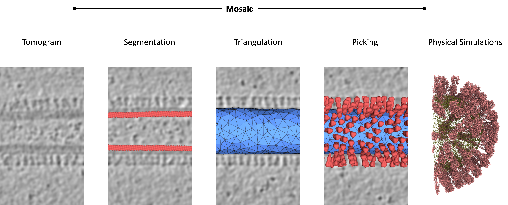
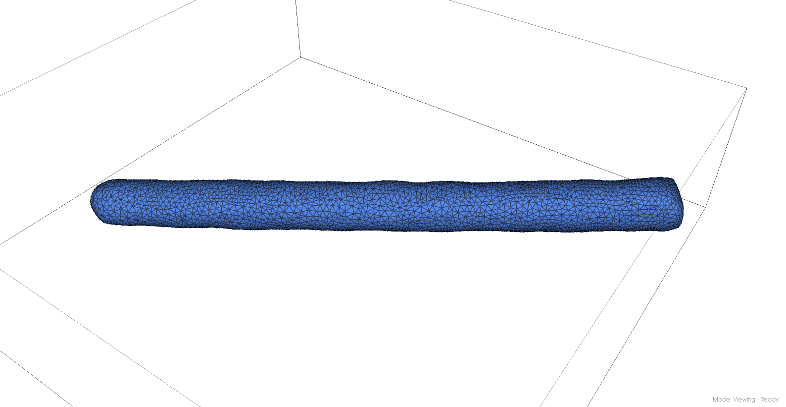
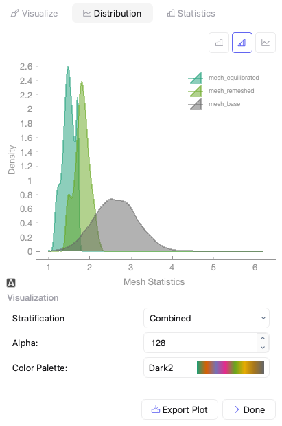
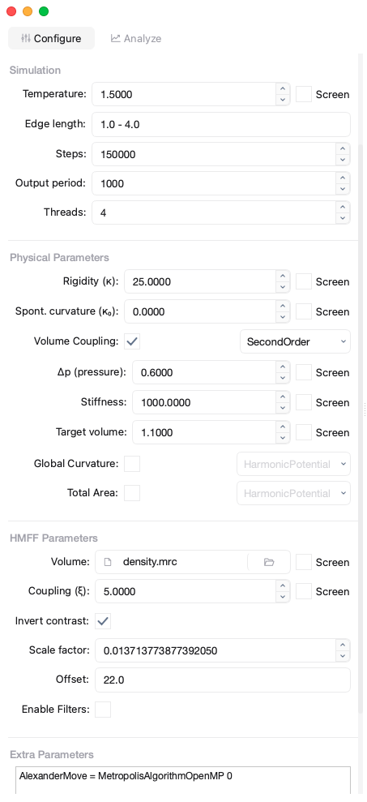

=================
Influenza A Virus
=================

This tutorial walks through analyzing Influenza A Virus (IAV) virus-like particles (VLPs), from membrane segmentation to coarse-grained Martini models.

   Coming up

Requirements
------------

Install Mosaic per the :doc:`installation instructions <../installation>`. For HMFF, install the :ref:`DTS Simulations <installation-dts>` dependencies. For backmapping, install the :ref:`DTS Backmapping <installation-backmapping>` tools.

.. note::

   Segmentation, template matching, and CG equilibration require a GPU. Pre-computed intermediates are available from `ownCloud <https://oc.embl.de/index.php/s/URqaMtuk0OWPKEi>`_.

Download the IAV VLP tomogram [1]_ from `EMDB-11075 <https://www.ebi.ac.uk/emdb/EMD-11075>`_:

.. code-block:: bash

   wget https://ftp.ebi.ac.uk/pub/databases/emdb/structures/EMD-11075/map/emd_11075.map.gz
   gunzip emd_11075.map.gz && mv emd_11075.map emd_11075.mrc

For segmentation, download the MemBrain_seg_v10_alpha weights [2]_ from `Google Drive <https://drive.google.com/file/d/1tSQIz_UCsQZNfyHg0RxD-4meFgolszo8/view>`_.

Visual Demonstration
--------------------

..  youtube:: -XyxZpJQoXA
   :width: 100%

.. _membrane-segmentation:

Membrane Segmentation
---------------------

1. In the **Intelligence** tab, click the arrow next to **Membrane** and configure:

   - Model: select the downloaded checkpoint file
   - Window Size: 160, Output Sampling: 12.0
   - Clustering: Enabled, Augmentation: Enabled

2. Click *Apply* and select the IAV VLP tomogram upon completion.

.. note::

   Without a GPU, use the segmentation from `ownCloud <https://oc.embl.de/index.php/s/URqaMtuk0OWPKEi>`_ and load via File > Open.

Mesh Creation
-------------

Clean the Segmentation
^^^^^^^^^^^^^^^^^^^^^^

1. In the **Segmentation** tab, select the *Cluster* section in the **Object Browser**
2. Click **Select** from **Base operations** and use the threshold slider to isolate the central IAV VLP
3. Close the selection window and press **delete** to remove small artifact clusters
4. Press **r** to activate the crosshair selector, then click-drag to select incorrectly segmented voxels near the tomogram edge. Press **delete** to remove them.
5. Select the VLP in the Object Browser:

   - In the **Segmentation** tab, click the arrow next to **Skeletonize** and choose *outer_hull*, click *Apply*
   - Select the result, click **Downsample**, choose *Center of Mass* with Radius: 48, click *Apply*

   .. versionchanged:: v1.1.0
      **Thin** was renamed to **Skeletonize**. The *outer* method was replaced by *outer_hull*.

.. raw:: html

   

     

       
      
Before cleanup

     

     

       
         
After cleanup

     

   

Generate Initial Mesh
^^^^^^^^^^^^^^^^^^^^^

1. In the **Parametrization** tab, select the cleaned segmentation
2. Click the arrow next to **Mesh** and configure:

   - Method: Ball Pivoting
   - Smoothness: 1.0, Curvature Weight: 1.0, Pressure: 0.0
   - Boundary Ring: 0, Radii: 60.0, Hole Size: Auto, Edge Length: 36

   **Edge Length** controls the resolution of the output mesh. A value of -1 (Auto) defaults to the input point spacing, in this case 48 Å from the previous downsampling step. Lowering the value produces smoother meshes at the cost of longer computation times.

   .. versionchanged:: v1.2.1
      Elastic Weight renamed to Smoothness. Volume Weight renamed to Pressure. Neighbors, Downsample, and Smoothing Steps were removed. Edge Length did not exist. Sensible parameters are Elastic Weight: 1.0, Curvature Weight: 10.0

3. Click *Apply*. Right-click the new mesh in the Object Browser and set **Representation** to **Mesh**.

   Initial mesh

Refine the Mesh
^^^^^^^^^^^^^^^

One cap of the VLP falls outside the tomogram. We resample and re-mesh to fill it:

1. Select the mesh, click **Sample** (Method: *Points*, 30000), click *Apply*
2. Select the sampled points, **Mesh** with the same settings as above, but Pressure 50, click *Apply*.

   .. versionchanged:: v1.2.1
      Volume Weight was renamed to Pressure. Use Volume Weight: 0.005 pre 1.2.1.

The filled cap should now extend beyond the original segmentation.

.. raw:: html

   

     

       
      
Cleaned mesh points

     

     

       
         
Pressurized mesh

     

   

Equilibrate the Mesh
^^^^^^^^^^^^^^^^^^^^

1. Select the refined mesh, go to **Intelligence** tab, click **Equilibrate**
2. Set Average Edge Length: 100, Steps: 5000

This produces three meshes: mesh_base (input), mesh_remeshed (target edge length), and mesh_equilibrated (equilibrated via Trimem [3]_). If you want to inspect them, load the output meshes via File > Open.

   Comparison of edge lengths

Inspect edge-length distributions using **Properties** in the **Segmentation** tab. Use the equilibrated mesh for DTS simulation.

.. note::

   Pre-computed meshes are available from `ownCloud <https://oc.embl.de/index.php/s/URqaMtuk0OWPKEi>`_.

HMFF Simulation
---------------

In the **Intelligence** tab, click **Setup** in the **DTS Simulation** section:

   HMFF simulation setup

- Mesh: mesh_equilibrated.q
- Volume: EMD-11075
- Invert Contrast: Enabled
- HMFF weight (ξ): 5.0, Rigidity (κ): 25.0
- Steps: 150000, Threads: 8
- Lowpass: 50Å, Highpass: 900Å

This creates setup files for DTS simulation [4]_ with HMFF. In input.dts, set:

- AlexanderMove   = MetropolisAlgorithmOpenMP 0
- VolumeCoupling  = SecondOrder 0.6 1000 1.1

.. code-block:: bash

      bash run.sh

.. note::

   Simulation outputs are available on `ownCloud <https://oc.embl.de/index.php/s/URqaMtuk0OWPKEi>`_ in hmff/TrajTSI_Done.

To load results, click the arrow next to **Trajectory** in the **Intelligence** tab:

- Scale: 0.012202743213335199
- Offset: 21.0,6.0,16.0

Use View > Trajectory player to navigate time points and View > Volume Viewer to overlay the density.

.. raw:: html

   

     

       
      
Initial mesh

     

     

       
         
HMFF-refined mesh

     

   

.. note::

   Frozen vertices indicate the simulation cannot develop them. Try increasing Min_Max_Lenghts or lowering the equilibration edge length.

Constrained Template Matching
-----------------------------

Generate Seed Points
^^^^^^^^^^^^^^^^^^^^

1. Select your desired trajectory time-point, right-click and **Duplicate**
2. In **Parametrization**, configure **Sample**: Method: *Distance*, Sampling: 40, Offset: 100

This places seed points ~40Å apart with a 100Å offset (roughly the center height of HA/NA). Export as STAR via right-click.

Template Matching
^^^^^^^^^^^^^^^^^

In the **Intelligence** tab, click **Setup** under Template Matching and configure PyTME [5]_:

- **Data**: set working directory, paths to EMD-11075 and HA/NA structures
- **Preprocess**: Lowpass: 15, Align Template Axis: z, Flip Template: checked
- **Matching**: Angular Step: 7, Score: FLC, seed points STAR file, Rotational Uncertainty: 15, Translational Uncertainty: (6,6,10) for HA / (6,6,12) for NA, Tilt Range: 60,60, Wedge Axes: 2,0, Defocus: 30000, No Centering: checked
- **Peak Calling**: PeakCallerMaximumFilter, 10000 peaks, Min Distance: 7 (HA) / 10 (NA)
- **Compute**: set cores, memory, backend: cupy

Click OK to generate and run the matching scripts.

.. note::

   Results are available from `ownCloud <https://oc.embl.de/index.php/s/URqaMtuk0OWPKEi>`_.

Refine Protein Picks
^^^^^^^^^^^^^^^^^^^^

1. Keep the top 97% of NA picks by score
2. Visualize and manually refine picks in Mosaic using the selection tool
3. Remove HA picks within 7 voxels of NA picks to resolve clashes

Filtering scripts: pytme/filter.py and pytme/resolve_clash.py on `ownCloud <https://oc.embl.de/index.php/s/URqaMtuk0OWPKEi>`_.

Coarse-Grained Martini Models
-----------------------------

Backmapping
^^^^^^^^^^^

1. In **Intelligence**, click **Backmapping**, select an output directory
2. Set target edge length to 20, add HA and NA inclusions

.. tip::

   The output also contains *mesh.tsi* for equilibrium DTS simulations with protein inclusions.

Coarse Graining
^^^^^^^^^^^^^^^

Edit *martinize.sh* to add PDB paths for *NA_STRUCTURE* and *HA_STRUCTURE*, then:

.. code-block:: bash

   bash martinize.sh

.. note::

   Protein principal axes must align with z. An example rotation script is available on `ownCloud <https://oc.embl.de/index.php/s/URqaMtuk0OWPKEi>`_ (pytme/templates/rot_structures.py).

Create the coarse-grained system using TS2CG [6]_:

.. code-block:: bash

   bash plm.sh   # Create bilayer
   bash pcg.sh   # Populate with lipids

This produces system.gro for MD simulation or visualization.

Equilibration
^^^^^^^^^^^^^

Gromacs [7]_ settings for Martini [8]_ equilibration are on `ownCloud <https://oc.embl.de/index.php/s/URqaMtuk0OWPKEi>`_ (ts2cg folder):

.. code-block:: bash

   bash equilibrate.sh

Energy minimization runs on a laptop. The final equilibration step should run on an HPC cluster (see eq/equilibrate.sbatch).

References
----------

.. [1] Peukes, J., Xiong, X., Erlendsson, S., Qu, K., Wan, W., Calder, L.J., Schraidt, O., Kummer, S., Freund, S.M.V., Kräusslich, H.G., Briggs, J.A.G. (2020). "The native structure of the assembled matrix protein 1 of influenza A virus". Nature, 587, 495-498. https://doi.org/10.1038/s41586-020-2696-8
.. [2] Lamm, L., Sieber, J., Chung, J.E. et al. (2024). "MemBrain-seg: Deep learning-based segmentation of cellular membranes in cryo-electron tomography". bioRxiv, doi.org/10.1101/2024.01.05.574336
.. [3] Siggel, M., Kehl, S., Reuter, K., Köfinger, J., Hummer, G. (2022). "TriMem: A parallelized hybrid Monte Carlo software for efficient simulations of lipid membranes". Journal of Chemical Physics, 157, 174801. https://doi.org/10.1063/5.0101118
.. [4] Pezeshkian, W., Ipsen, J.H. (2024). "Mesoscale simulation of biomembranes with FreeDTS". Nature Communications, 15, 548. https://doi.org/10.1038/s41467-024-44819-w
.. [5] Maurer, V.J., Siggel, M., Kosinski, J. (2024). "PyTME (Python Template Matching Engine): A fast, flexible, and multi-purpose template matching library for cryogenic electron microscopy data". SoftwareX, 25, 101636. https://doi.org/10.1016/j.softx.2023.101636
.. [6] Pezeshkian, W., König, M., Wassenaar, T.A., Marrink, S.J. (2020). "Backmapping triangulated surfaces to coarse-grained membrane models". Nature Communications, 11, 2296. https://doi.org/10.1038/s41467-020-16094-y
.. [7] Abraham, M.J., Murtola, T., Schulz, R., Páll, S., Smith, J.C., Hess, B., Lindahl, E. (2015). "GROMACS: High performance molecular simulations through multi-level parallelism from laptops to supercomputers". SoftwareX, 1-2, 19-25. https://doi.org/10.1016/j.softx.2015.06.001
.. [8] Souza, P.C.T., Alessandri, R., Barnoud, J., Thallmair, S., Faustino, I., Grünewald, F., Patmanidis, I., Abdizadeh, H., Bruininks, B.M.H., Wassenaar, T.A., Kroon, P.C., Melcr, J., Nieto, V., Corradi, V., Khan, H.M., Domański, J., Javanainen, M., Martinez-Seara, H., Reuter, N., Best, R.B., Vattulainen, I., Monticelli, L., Periole, X., Tieleman, D.P., de Vries, A.H., Marrink, S.J. (2021). "Martini 3: a general purpose force field for coarse-grained molecular dynamics". Nature Methods, 18, 382-388. https://doi.org/10.1038/s41592-021-01098-3
