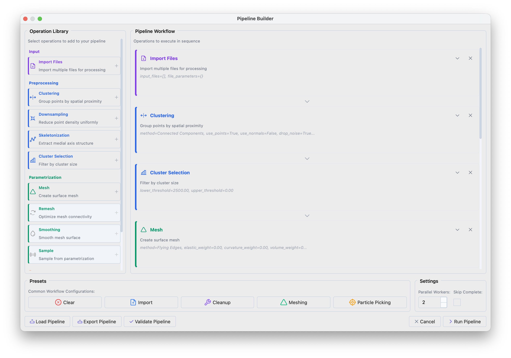
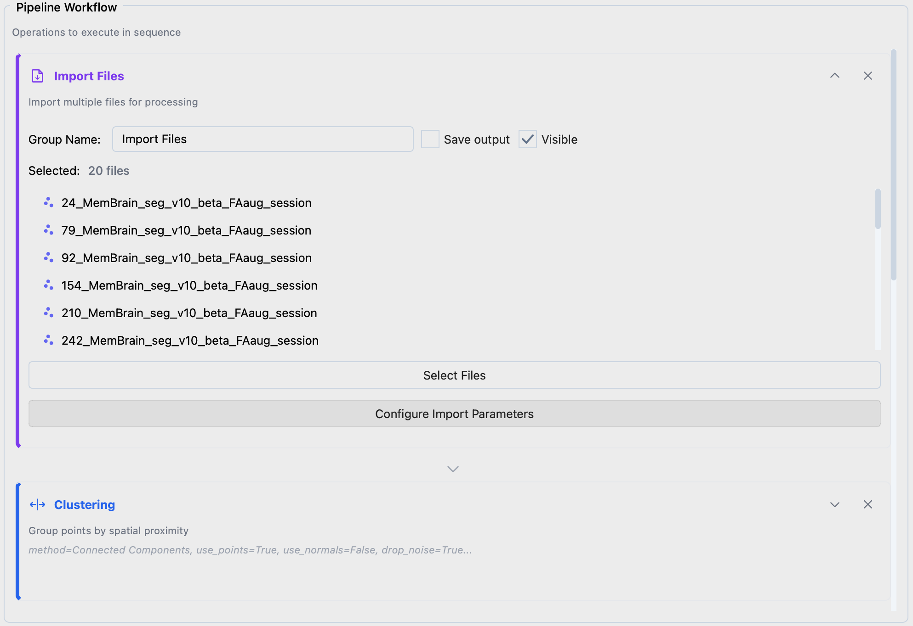
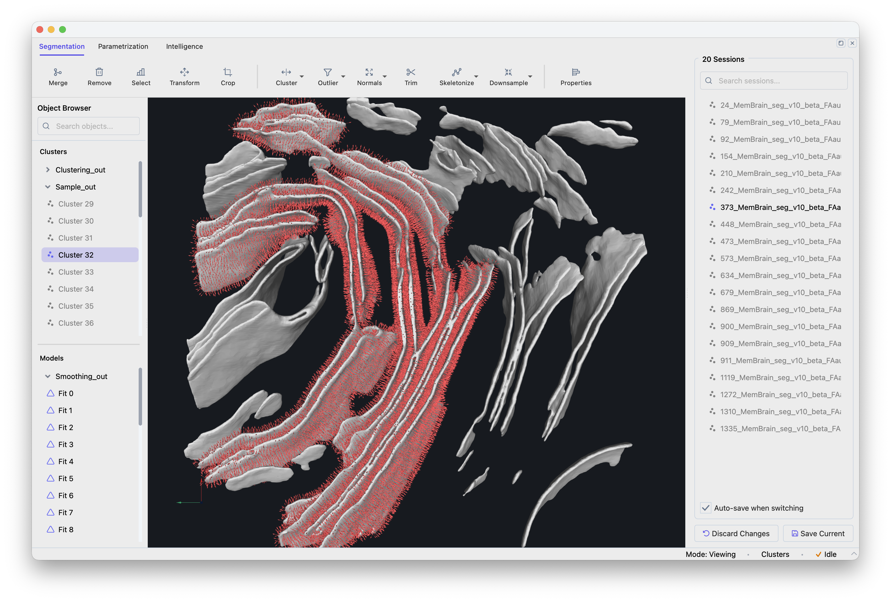

==================
Batch Processing
==================

This tutorial demonstrates how to build reproducible pipelines that process entire cryo-ET datasets automatically. Starting from membrane segmentations, we generate seed points for constrained template matching.

.. note::

   Batch processing is available from version 1.1.0.

Requirements
------------

Install Mosaic according to the :doc:`installation instructions <../installation>`.

This tutorial assumes voxel-level membrane segmentations are available, with one file per tomogram:

.. code-block:: text

   segmentations/
   ├── tomo_001_seg.mrc
   ├── tomo_002_seg.mrc
   ├── ...
   └── tomo_100_seg.mrc

Creating a Processing Pipeline
------------------------------

Open the Pipeline Builder via **File > Batch Processing** (or **Ctrl+Shift+P**).

   Pipeline Builder interface showing the operation library (left) and workflow panel (right).

Click the **Particle Picking** preset in the bottom panel to load a standard workflow. The preset performs:

1. **Clustering** — separates the segmentation into distinct membrane compartments
2. **Filtering** — removes small fragments (segmentation artifacts)
3. **Meshing + Smoothing** — creates a smooth triangular surface
4. **Sampling** — places evenly-spaced points with surface normals along the membrane

Configuring Input Files
^^^^^^^^^^^^^^^^^^^^^^^

Expand **Import Files**, click **Select Files** to choose your segmentations. Use **Configure Import Parameters** if file headers need correction.

   Import Files configuration.

Choosing Parameters
^^^^^^^^^^^^^^^^^^^

**Clustering**

Separates membranes (plasma membrane, ER, mitochondria, etc.) that should be processed independently.

- Method: *Connected Components* — identifies spatially separated regions
- Distance: *-1.0* — single-voxel connectivity

**Cluster Selection**

Removes small clusters based on point count. The threshold depends on pixel size: at 7 Å/px use 2000–8000; at 14 Å/px use 500–1000. Inspect a few segmentations to calibrate.

**Mesh**

Converts the point cloud into a triangular surface.

- Method: *Flying Edges* — fast, works well for dense volumes

Flying Edges extracts the segmentation contour, producing a closed surface with seed points on both sides of the membrane. Alternative methods (see the *Meshing* preset) fit a surface through the segmentation center, producing single-sided normals — useful when you want to restrict template matching to one side.

**Remesh and Smoothing**

Reduces voxel-level noise in the mesh. Without smoothing, surface normals are noisy and do not represent the true membrane orientation.

- Method: *Taubin* — preserves shape while reducing noise
- Iterations: *10*

**Sample**

Places seed points at regular intervals along the surface. Together with surface normals, these constrain template matching to search near the membrane.

- Method: *Distance* — uniform spacing
- Sampling: distance in Å between points (30 Å works for most cases)
- Offset: distance from the surface toward the protein center (~half the target protein height)

**Export Data**

- Format: *STAR* for PyTME compatibility
- Output Directory: where to save seed point files

**Save Session**

Saves sessions for review and manual correction in Mosaic.

Execution Settings
^^^^^^^^^^^^^^^^^^

- **Parallel Workers**: files processed simultaneously (~8 GB memory per worker)
- **Skip Complete**: resume interrupted runs by skipping files with existing output

Running the Pipeline
--------------------

Click **Run Pipeline**. Progress is shown in the bottom-right corner. The Batch Navigator opens on completion.

Cluster Execution
^^^^^^^^^^^^^^^^^

Export the pipeline as ``pipeline.json`` via **Export Pipeline**, then run on an HPC cluster:

.. code-block:: bash

   # Process all files
   mosaic-pipeline pipeline.json --workers 8

   # Resume, skipping completed files
   mosaic-pipeline pipeline.json --workers 8 --skip-complete

   # Preview without executing
   mosaic-pipeline pipeline.json --dry-run

SLURM job array example (``sbatch run_pipeline.sh``):

.. code-block:: bash

   #!/bin/bash
   #SBATCH --job-name=mosaic_batch
   #SBATCH --cpus-per-task=2
   #SBATCH --mem=12G
   #SBATCH --time=01:00:00
   #SBATCH --output=logs/mosaic_%A_%a.out

   CONFIG="/path/to/pipeline.json"

   # Self-submitting: first run determines array size
   if [ -z "$SLURM_ARRAY_TASK_ID" ]; then
       mkdir -p logs
       N_RUNS=$(mosaic-pipeline "$CONFIG" --dry-run | head -1 | grep -oP '\d+')
       sbatch --array=0-$((N_RUNS-1)) "$0"
       exit 0
   fi

   mosaic-pipeline "$CONFIG" --index $SLURM_ARRAY_TASK_ID

Reviewing Results
-----------------

Open the Batch Navigator via **File > Batch Navigator** (or **Ctrl+Shift+N**).

   Batch Navigator showing the session list.

Click a session to load it. Modifications are auto-saved when switching sessions. Verify that membranes are properly separated, artifacts filtered, meshes smooth, and seed points evenly distributed.

Using Seed Points for Template Matching
---------------------------------------

The exported STAR files contain coordinates and surface normals for constrained template matching. In PyTME, configure via **Intelligence > Template Matching > Setup** with your seed points file and search constraints (rotational uncertainty 15–20°, translational uncertainty 5–10 Å).

See the `PyTME documentation <https://kosinskilab.github.io/pyTME/quickstart/matching/cluster.html>`_ for scaling to full datasets.

Pipeline Operations Reference
------------------------------

Input
^^^^^

**Import Files**
   Loads files for batch processing. Supported: sessions (.pickle), point clouds (STAR, XYZ, TSV), meshes (OBJ, STL, PLY), volumes (MRC, EM).

Preprocessing
^^^^^^^^^^^^^

**Clustering**
   Partitions point clouds into spatially coherent groups.

   - *Connected Components*: disjoint regions by spatial connectivity
   - *Leiden*: graph-based community detection
   - *K-Means*: k clusters by within-cluster variance minimization
   - *DBSCAN*: density-based clustering

**Downsampling**
   Reduces point density.

   - *Radius*: removes points within a specified radius of each other

**Skeletonization**
   Extracts the medial axis of tubular structures.

**Cluster Selection**
   Filters clusters by point count (lower/upper threshold).

Parametrization
^^^^^^^^^^^^^^^

**Mesh**
   Generates triangular surfaces from point clouds.

   - *Flying Edges*: fast isosurface extraction from volumetric data
   - *Poisson*: smooth, watertight surfaces (requires consistent normals)
   - *Ball Pivoting*: surface reconstruction for partial surfaces
   - *Alpha Shape*: generalized convex hull with adjustable detail

**Remesh**
   - *Decimation*: reduces triangle count while preserving geometry
   - *Subdivision*: increases mesh resolution

**Smoothing**
   - *Taubin*: iterative smoothing without shrinkage
   - *Laplacian*: moves vertices toward neighbor centroids (may shrink)

**Sample**
   Generates point samples from mesh surfaces.

   - *Distance*: uniform spacing with surface normals
   - *Points*: random uniform samples

Export
^^^^^^

**Export Data**
   Point clouds (STAR, XYZ, TSV), meshes (OBJ, STL, PLY), volumes (MRC, EM, H5).

**Save Session**
   Serializes the complete session state.

Troubleshooting
---------------

**Memory errors during parallel execution**
   Reduce worker count. Each worker needs ~8 GB RAM depending on segmentation size.
